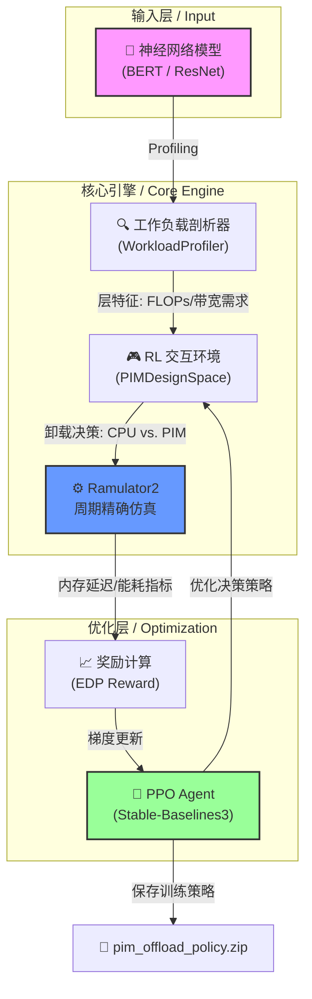

# Neuro-CXL-PIM 🚀🧠

<p align="center">
  
  
  
  
</p>

> **Neuro-CXL-PIM** —— 基于强化学习（RL）的 CPU/PIM 智能卸载决策框架。通过集成周期精确（Cycle-accurate）的内存仿真器 Ramulator 2.0，为下一代 CXL 挂载的近内存计算（PIM）提供科学的设计空间探索（DSE）方案。✨

---

## 📖 目录
- [🌟 项目核心亮点](#-项目核心亮点)
- [🏗️ 全景架构图](#-全景架构图)
- [🛠️ 核心模块解析](#-核心模块解析)
- [🚀 快速上手指南](#-快速上手指南)
  - [环境依赖](#环境依赖)
  - [一键安装](#一键安装)
  - [编译仿真引擎](#编译仿真引擎)
  - [运行 DSE 训练](#运行-dse-训练)
- [⚙️ 配置说明](#-配置说明)
- [📊 实验与评估](#-实验与评估)
- [📜 引用信息](#-引用信息)
- [🤝 贡献与致谢](#-贡献与致谢)

---

## 🌟 项目核心亮点

Neuro-CXL-PIM 致力于解决异构内存系统中的算力分配难题，其核心特性包括：
- 🧠 **RL 驱动决策**：采用高性能 PPO 算法，自动学习针对 BERT、ResNet 等模型的复杂卸载策略。
- ⚡ **纳秒级精度仿真**：通过 Ramulator 2.0 实现对 DRAM/CXL 总线级延迟的精确量化。
- 🔋 **多维能效评估**：不仅关注延迟，更深入分析 EDP（能量延迟乘积），平衡链路功耗与算力增益。
- 🧩 **高度模块化**：支持自定义新的神经网络工作负载、硬件参数及内存层级架构。

---

## 🏗️ 全景架构图

本项目实现了从工作负载剖析到策略优化的完整闭环：



---

## 🛠️ 核心模块解析

### 1. `main_dse.py` —— 设计空间指挥部
本项目的大脑。它不仅通过 `PIMDesignSpace` 类封装了 Gymnasium 标准环境，还定义了高保真的硬件功耗模型。它桥接了高层的 RL 决策与底层的 C++ 仿真引擎。

### 2. `workload_analysis.py` —— 负载剖析专家
该模块实现了对现代深度神经网络（如 Transformer 架构）的层级特征提取。它能识别哪些层是“计算受限型（Compute-bound）”，哪些是“访存受限型（Memory-bound）”，从而为 RL Agent 提供关键的决策原语。

### 3. `ramulator2` —— 仿真动力源
集成 CMU SAFARI 实验室的最新成果，负责处理每个决策步骤产生的访存踪迹（Traces）。通过对 DDR4/HBM 配置的深度模拟，确保了研究结论的科学严谨性。

---

## 🚀 快速上手指南

### 环境依赖

- **操作系统**: Ubuntu 20.04+ (推荐) / macOS
- **Python**: 3.8+
- **构建工具**: CMake 3.14+, C++20 兼容编译器 (g++-12 或 clang++-15)

### 一键安装

```bash
# 克隆仓库
git clone https://github.com/lkcfqy/Neuro-CXL-PIM.git
cd Neuro-CXL-PIM

# 创建虚拟环境并安装依赖
python3 -m venv .venv
source .venv/bin/activate
pip install -r requirements.txt
```

### 编译仿真引擎

```bash
cd ramulator2
mkdir -p build && cd build
cmake ..
make -j$(nproc)
cd ../..
```

### 运行 DSE 训练

启动默认训练流程（以 BERT 为工作负载）：

```bash
python main_dse.py
```

> [!TIP]
> 训练完成后，模型将自动保存为 `pim_offload_policy.zip`。您可以通过修改 `cxl_pim_config.yaml` 来调整 RL 超参数或硬件限制。

---

## ⚙️ 配置说明

通过 `cxl_pim_config.yaml` 灵活定制您的硬件设计空间：

```yaml
Hardware:
  cpu_freq: 3.0GHz
  pim_freq: 1.0GHz
  cxl_latency_ns: 200

RL:
  algorithm: PPO
  total_timesteps: 100000
  learning_rate: 3e-4
```

---

## 📊 实验与评估

项目支持多维度的指标分析，训练结束后会输出：
- **CPU vs. PIM 负载分布图**
- **归一化 EDP 趋势曲线**
- **层级延迟对比分析**

---

## 📜 引用信息

如果您在研究中使用了本项目，请引用我们的工作：

```bibtex
@misc{neuro-cxl-pim,
  title={Neuro-CXL-PIM: RL-based Intelligent CPU/PIM Offloading for Neural Networks},
  author={lkcfqy},
  year={2026},
  url={https://github.com/lkcfqy/Neuro-CXL-PIM}
}
```

---

## 🤝 贡献与致谢

- **Ramulator 2.0**: 感谢 CMU SAFARI 团队提供的强力内存模拟平台。
- **Stable-Baselines3**: 提供了稳健的强化学习算法实现。

---

> [!NOTE]
> 本项目由 **Antigravity** 协同审计完成。保持对近内存计算的探索热情，祝您的实验如丝般顺滑！🦢✨
